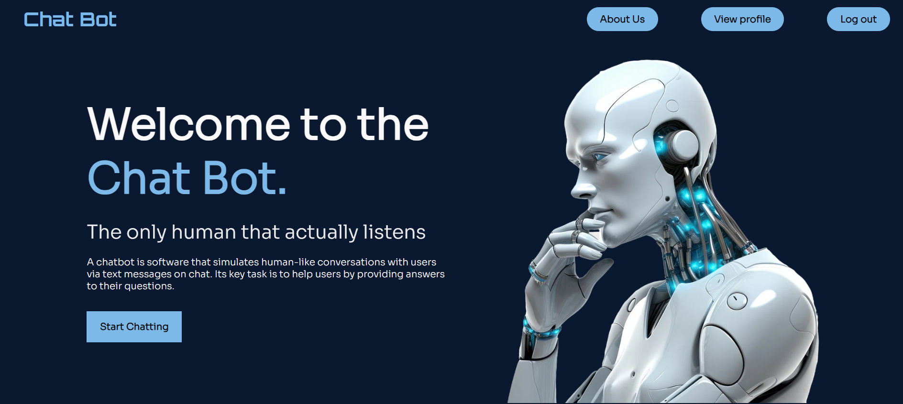

# PROJEKAT iz predmeta ITEH - ChatBot

Ovo je prvi domaći iz predmeta Iteh na temu ChatBot. Tim koji je radio na projektu čine:

- **Filip Lasic** (Broj indeksa: 2020/1010)
- **Ilija Jeremić** (Broj indeksa: 2011/0213)

# ChatBot Aplikacija

Ova aplikacija omogućava korisnicima interakciju sa chatbot-om kroz različite funkcionalnosti prilagođene različitim korisničkim ulogama. Aplikacija nudi personalizovane opcije za korisnike bez naloga, prijavljene korisnike, kao i administratore.


# Korisnicki Zahtev

Aplikacija ChatBot pruža korisnicima različite nivoe pristupa i funkcionalnosti, u zavisnosti od njihove uloge unutar sistema. Postoje tri glavne korisničke uloge: običan korisnik bez naloga, korisnik sa nalogom, i administrator, a svaka od ovih uloga omogućava različite funkcionalnosti i mogućnosti.

Običan korisnik bez naloga ima pristup osnovnim stranicama aplikacije koje mu omogućavaju da se upozna sa njenim funkcionalnostima i registruje ukoliko to želi. Ova uloga omogućava korisniku da pregleda početnu stranicu aplikacije, koja sadrži osnovne informacije o ChatBot-u, kao i stranicu sa detaljnijim opisom aplikacije. Na stranici opisa nalazi se i 3D model chatbot animacije, koji dodatno ilustruje rad aplikacije. Osim toga, korisnik može pristupiti stranici za registraciju ili prijavu, gde može kreirati novi nalog ili se prijaviti ukoliko već ima nalog.

Nakon što korisnik kreira nalog i prijavi se u aplikaciju, dobija pristup dodatnim funkcionalnostima koje nisu dostupne običnim korisnicima bez naloga. Prijavljeni korisnik može pregledati svoju istoriju chata sa botom i nastaviti razgovor od tačke gde je prethodno stao. Pored toga, korisnik može pristupiti svom profilu, gde su prikazani njegovi lični podaci, uključujući ime, email adresu, opis, i avatar. Kao dodatna funkcionalnost, svakodnevno mu se prikazuje generisani GIF dana. Korisnik može po želji ažurirati svoje podatke ili se odjaviti iz aplikacije.

Uloga administratora u aplikaciji značajno se razlikuje od uloge običnog korisnika, jer uključuje specifične funkcionalnosti vezane za upravljanje korisnicima. Administrator, po prijavi, dobija drugačiju početnu stranicu, prilagođenu njegovim potrebama, dok i dalje ima pristup stranici sa opisom aplikacije. Njegova glavna funkcija je pregled i upravljanje korisnicima aplikacije, što se obavlja kroz posebnu stranicu sa tabelarnim prikazom svih korisnika. Administrator može pretraživati, sortirati i filtrirati korisnike po različitim kriterijumima, kao i menjati njihove podatke poput imena i email adrese. Takođe, administrator ima mogućnost brisanja korisnika, paginacije kroz tabelu radi lakšeg pregleda, i eksportovanja tabele u .csv formatu za dalju analizu ili izveštavanje.

Aplikacija ChatBot je razvijena korišćenjem MERN stack-a, koji uključuje MongoDB, Express.js, React, i Node.js, što omogućava robusnu i skalabilnu strukturu za razvoj modernih web aplikacija. U skladu sa savremenim razvojnim praksama, aplikacija je organizovana prema MVC (Model-View-Controller) paternu, čime se obezbeđuje jasno razdvajanje logike, korisničkog interfejsa i podataka, što olakšava održavanje i nadogradnju sistema. Klijent-server arhitektura aplikacije omogućava efikasnu komunikaciju između frontend i backend komponenti.


## Slučajevi Korišćenja

### Korisnik Bez Naloga
- **Pregled Početne Stranice:** Korisnik bez naloga može pregledati osnovne informacije o aplikaciji na početnoj stranici.
- **Pregled Opisa Aplikacije:** Dostupan je detaljan opis funkcionalnosti aplikacije, interaktivni 3D model chatbot-a, i sekcija "Quote of the Day in Tech" sa inspirativnim citatima.
- **Registracija Novog Naloga:** Korisnik može kreirati novi nalog popunjavanjem forme sa imenom, email adresom, lozinkom, opisom i linkom ka slici za avatara.
- **Prijava na Postojeći Nalog:** Korisnik bez naloga može se prijaviti koristeći postojeći nalog putem email adrese i lozinke.

### Korisnik Sa Nalogom
- **Pregled Početne Stranice i Stranice sa Opisom Aplikacije:** Prijavljeni korisnici imaju pristup početnoj stranici i stranici sa opisom aplikacije.
- **Nastavak ili Početak Chata sa Botom:** Korisnici mogu nastaviti prethodno započet chat ili započeti novi razgovor sa chatbot-om.
- **Pregled Profila:** Pristup stranici profila gde korisnici mogu pregledati svoje podatke i dnevni GIF.
- **Odjava iz Aplikacije:** Prijavljeni korisnici se mogu odjaviti iz aplikacije.

### Administrator
- **Pregled i Upravljanje Korisnicima:** Administratori mogu pregledati i upravljati korisnicima aplikacije putem tabele.
- **Filtriranje, Sortiranje i Pretraga Korisnika:** Dostupne su funkcije filtriranja po polu, sortiranja po broju poruka i pretraga korisnika po imenu.
- **Izmena Podataka Korisnika:** Administratori mogu menjati podatke korisnika (ime i email) direktno iz tabele.
- **Brisanje Korisnika:** Administratori mogu obrisati korisnike koji više ne koriste aplikaciju.
- **Eksportovanje Tabele:** Administratori imaju opciju eksportovanja liste korisnika u .csv formatu.
- **Pregled Stranice sa Opisom Aplikacije:** Kao i ostali korisnici, administratori imaju pristup stranici sa opisom aplikacije.
- **Odjava iz Aplikacije:** Administratori se mogu odjaviti iz aplikacije kada završe svoje zadatke.

## Instalacija

1. Klonirajte repozitorijum:
   ```bash
   git clone git@github.com:elab-development/internet-tehnologije-projekat-chatbot_2020_1010.git
2. Instalirajte biblioteke:
    `npm install`
3. Udjite u direktorijum za server:
    `cd server`
    `npm start`
4. Udjite u direktorijum za klijenta:
    `cd server`
    `npm start`
5. Pokrenite aplikaciju u web pregledacu i pokrenite caskanje!





[](https://classroom.github.com/a/1IMeAlJr)
